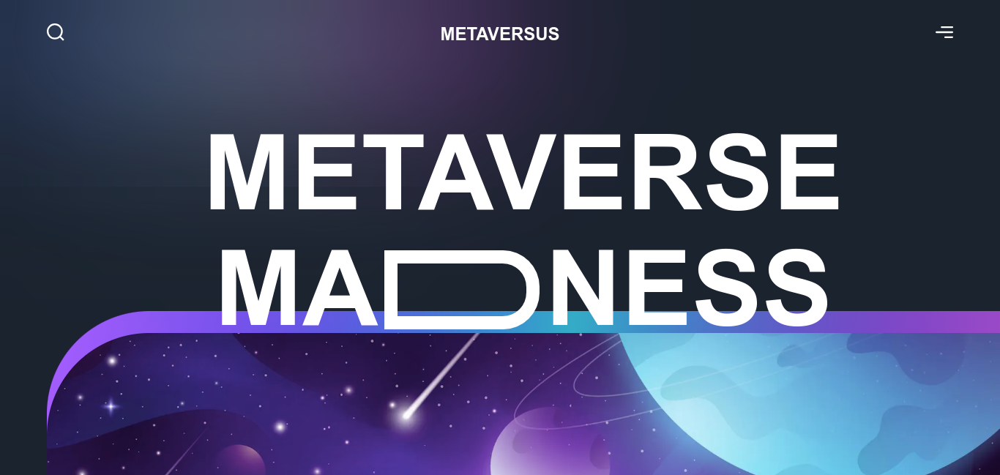

# Metaverse Madness

This project is front end slicing from [Metaverse Madness](https://www.figma.com/file/EyzNoOFak1Nb1bBx9ZKI7E/Modern-UI%2FUX-Framer-Motion?t=U27Izw4pXMDE1r3r-0) design to implement framer motion with NextJS and TailwindCSS.

Live example hosted on Vercel: https://ikram-metaversus.vercel.app



## 🖥️ Running Locally

1. Clone this repo

   ```bash
   git clone https://github.com/Ikram-Maulana/metaverse-madness.git
   ```

2. Install dependencies

   ```bash
   cd metaverse-madness
   bun install
   ```

3. Run the development server

   ```bash
   bun run dev
   ```

4. Open [http://localhost:3000](http://localhost:3000) with your browser to see the result.
